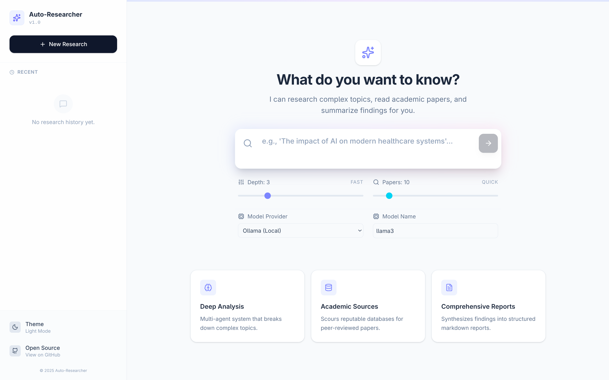

# 🔬 Auto-Researcher




**Auto-Researcher** is an autonomous, multi-agent system that performs deep academic research, analyzes complex papers, synthesizes comprehensive reviews with verified citations, and provides rich interactive features for exploring results.

The frontend is a polished React 19 app with animated dashboards, zero-knowledge encryption, biometric unlock, an interactive knowledge graph, **image galleries**, **follow-up chat**, **citation style switching**, **executive briefs**, **research timelines**, and **PDF file upload**.

---

## ✨ Features

| Feature | Description |
| :--- | :--- |
| **Multi-agent pipeline** | Three autonomous agents (Researcher, Analyst, Critic) collaborate in a feedback loop with up to 3 revision passes |
| **Academic search** | Searches ArXiv and PDF repositories, parses full-text documents, ranks by relevance (Tavily + DuckDuckGo) |
| **10+ LLM providers** | Ollama, OpenAI, Anthropic, Google, DeepSeek, Mistral, Groq, Perplexity, Together — local or cloud |
| **Knowledge graph** | Interactive force-directed graph of cited papers — click any node to open the source |
| **Structured reports** | Rich Markdown with Executive Summary, Key Findings, Critical Analysis, Methodological Notes, and Implications |
| **Image gallery** | Automatically fetches related images and charts/graphs for any research topic (powered by DuckDuckGo Images) |
| **Follow-up chat** | Ask questions about the report — answers include formatted Markdown with source citation badges linked to the actual papers |
| **Citation styles** | Switch between Inline `[S#]`, APA, MLA, Chicago, and IEEE citation formats |
| **Executive brief** | AI-generated concise summary extracted from the report's key sections |
| **Research timeline** | Extracts year-based milestones from the report and arXiv source URLs into a visual timeline |
| **PDF upload & analysis** | Upload multiple PDF files (drag & drop), extract text, and include the content as additional context for research |
| **DOI resolution** | Automatically resolves DOIs for arXiv sources and displays clickable DOI badges on reference cards |
| **Print as PDF** | Generates a styled HTML page optimized for printing as PDF |
| **Text-to-speech** | Reads the report aloud with markdown syntax stripped for clean audio |
| **Zero-knowledge encryption** | Passphrase-protected with WebAuthn biometric unlock (fingerprint, Face ID, Windows Hello). API keys encrypted end-to-end in your browser |
| **Critique & revision** | Automatic scoring, hallucination detection, and citation validation with configurable strictness |
| **Deep controls** | Configure search depth, source count, critic strictness, and custom model overrides |
| **Research queue** | Click multiple topics and they run sequentially — no parallel conflicts |
| **Trending topics** | Fetch trending research topics from the API with localStorage caching and manual refresh |
| **Collapsible sidebar** | Compact icon-only mode with history browsing, semantic search, and passphrase management |
| **Biometric unlock** | Fingerprint, Face ID, or Windows Hello via WebAuthn PRF extension with emergency recovery codes |
| **Dark mode** | Full theme support persisted to localStorage with theme-aware favicon |
| **Welcome page** | Rich marketing landing page with hero section, animated metrics, and feature overview |

---

## 🧠 How It Works

The system uses a **Graph-based Multi-Agent Architecture** (built with LangGraph) with **real-time streaming** via Server-Sent Events (SSE):


1. **🕵️ The Researcher**
   - **Parallel Search** — Simultaneously queries Tavily and DuckDuckGo for maximum coverage
   - **Academic Filtering** — Targets `arxiv.org`, `.edu`, `.ac.uk`, and `researchgate.net`
   - **Smart Parsing** — Downloads PDFs with PyMuPDF (Fitz), extracts high-density text, and ignores references/bibliographies to save context window

2. **✍️ The Analyst**
   - **High-Density Synthesis** — Drafts comprehensive reports (2400+ words for deep searches)
   - **Thematic Grouping** — Automatically organizes findings into logical themes
   - **Structured Output** — Generates Markdown with Executive Summary, Key Findings, Methodological Notes, and Implications

3. **⚖️ The Critic**
   - **Fact-Checking** — Reviews the draft for hallucinations and vague generalizations
   - **Quantitative Enforcement** — Rejects drafts that lack specific numbers and data
   - **Feedback Loop** — Triggers up to 3 revision cycles if the quality score drops below the configured threshold

**Real-time Streaming:** The backend pushes events (SSE) so you can watch agents transition live — Researching → Drafting → Critiquing — as they work.


---

## 🛠️ Tech Stack

| Layer | Technology |
| :--- | :--- |
| **Backend** | Python, FastAPI, LangGraph, LangChain |
| **Streaming** | Server-Sent Events (SSE) |
| **Frontend** | React 19, Vite, TypeScript |
| **Styling** | Tailwind CSS v4, Framer Motion |
| **Graphs** | React Force Graph (2D) |
| **Routing** | React Router v7 |
| **LLM Engine (Local)** | Ollama (Llama 3, Mistral, etc.) |
| **LLM Engine (Cloud)** | OpenAI, Anthropic, Google, DeepSeek, Mistral, Groq, Perplexity, Together, OpenRouter |
| **Search** | Tavily API + DuckDuckGo fallback |
| **Images** | DuckDuckGo Image Search (DDGS) |
| **PDF** | PyMuPDF (Fitz) |
| **Auth** | WebAuthn PRF (biometric unlock) + PBKDF2 encryption |
| **Markdown** | react-markdown |

---

## 🖼️ Image Gallery

Every research report includes a **Related Images** and **Charts & Visualizations** gallery:

- Fetches images from DuckDuckGo using the research topic as query
- Charts/graphs are fetched with enriched queries (`"chart graph data visualization"`)
- Click any image to open a **lightbox** with keyboard navigation (← → ESC) and dimension info
- Images show source domain and link to the original page
- Results are cached in-memory on the backend for 1 hour

## 💬 Follow-up Chat

The **Ask Follow-up** panel lets you ask questions about the completed report:

- Answers are formatted in **Markdown** with headings, paragraphs, bullet points, and **bold** terms
- **Source citation badges** (`[S1]`) link directly to the referenced paper URLs
- Code blocks include a **copy button** on hover
- **Suggested questions** (Summarize key findings, What are the limitations?) for quick interaction
- **Copy message** button on each assistant response
- Relative timestamps ("Just now", "2m ago") on every message
- Uses the same LLM provider selected for the research (no separate configuration needed)

## 📚 Citation Styles

Switch between citation formats on the fly — the report re-renders instantly:

- **Inline** — `[S1]`, `[S2]` (default)
- **APA** — `(Author et al., n.d.)`
- **MLA** — `(Author 1)`
- **Chicago** — Superscript numbers
- **IEEE** — Bracketed numbers `[1]`

## 📝 Executive Brief

Click the **Brief** button to generate a simplified executive summary extracted from the report's Introduction / Executive Summary and Key Findings sections — no LLM call needed.

## 📅 Research Timeline

Click the **Timeline** button to extract year-based milestones from the report content and arXiv source URLs. Years are parsed from text (1900–2029) and arXiv submission dates, displayed in a scrollable timeline with connecting lines.

## 📄 PDF Upload & Analysis

Upload PDFs via drag-and-drop or file picker in the research form:

- **Multiple file upload** — Upload and select multiple PDFs to include as research context
- **Text extraction** — PDF text is extracted with PyMuPDF and truncated to the configured max context length
- **File management** — Uploaded files persist in localStorage with selection checkboxes, expandable previews, and individual removal
- **Selected files** are concatenated and sent as additional context with `[U1]` markers in the agent pipeline

## 🔗 DOI Badges

arXiv source URLs automatically resolve their DOIs via the arXiv API:

- Displays clickable **DOI badges** on reference cards
- Prefixed with the `Unlink` icon for quick identification
- DOIs are cached in-memory to avoid repeated API calls
- arXiv sources without DOIs show an "arXiv" label

## 🖨️ PDF Export

Click the **Print** icon to generate a styled HTML print view of the report with proper typography, table styling, code highlighting, and a formatted sources section. Opens in a new tab and triggers the browser's print dialog.

## 🔊 Text-to-Speech

Click the **volume** icon to have the report read aloud. Markdown syntax (headings, bold, links, code blocks, citations) is automatically stripped so only clean text is spoken.

---

## ⚡ Getting Started

### Prerequisites

- Python 3.10+
- Node.js 18+
- [Ollama](https://ollama.com/) installed and running (for local mode)

### Installation

```bash
# Clone the repository
git clone https://github.com/royxlead/auto-researcher-python.git
cd auto-researcher-python

# Setup Backend
python -m venv .venv
source .venv/bin/activate  # Windows: .venv\Scripts\activate
pip install -r requirements.txt

# Setup Frontend
cd frontend
npm install
```

### Configuration

Create a `.env` file in the project root:

```env
TAVILY_API_KEY=your_key_here

# Local Mode
OLLAMA_BASE_URL=http://localhost:11434
OLLAMA_MODEL=llama3:8b

# Cloud Mode (Optional — any of these)
OPENAI_API_KEY=sk-...
ANTHROPIC_API_KEY=sk-ant-...
GOOGLE_API_KEY=AIza...
DEEPSEEK_API_KEY=sk-...
```

### Running

```bash
# Terminal 1 - Backend
python run.py

# Terminal 2 - Frontend
cd frontend && npm run dev
```

Open `http://localhost:5173` in your browser. The Welcome page greets you with a live dashboard, example report preview, and feature overview. Click **Launch the app** or navigate to `/app` to start researching.

### Usage

1. Enter a research topic (e.g., *"Impact of solid-state batteries on EV range"*)
2. Configure your research:
   - **Depth** — Fast / Balanced / Deep (1–10)
   - **Papers** — 5–50 sources
   - **Strictness** — The Critic's threshold (Lenient / Balanced / Strict)
   - **Provider** — Ollama (local) or any cloud provider
   - **Model** — Custom model name override
3. Click the arrow to start — watch agents work in real-time
4. Interact with the report:
   - **Read Aloud** — Text-to-Speech
   - **Visualize** — Explore the Knowledge Graph
   - **Images** — Browse related images and charts
   - **Chat** — Ask follow-up questions
   - **Export** — Download as Markdown or Print as PDF
   - **Cite** — Switch citation styles

#### Trending Topics

Click any trending topic chip to instantly kick off research. Click multiple and they queue up. The refresh button (`↻`) fetches updated topics from the API.

#### Passphrase & Biometric Unlock

Set a passphrase in the sidebar to encrypt your API keys end-to-end. Optionally register a biometric credential (fingerprint, Face ID, Windows Hello) for one-tap unlock on repeat visits. If you lose access, use your 5-word emergency recovery code.

---

## 🗺️ Project Structure

```
auto-researcher-python/
├── run.py                    # Backend entry point (uvicorn)
├── requirements.txt
├── src/
│   ├── api.py                # FastAPI routes + SSE streaming
│   ├── config.py             # Environment configuration
│   ├── schemas.py            # Pydantic models
│   ├── agents/
│   │   ├── graph.py          # LangGraph workflow definition
│   │   ├── nodes.py          # Agent node functions
│   │   └── state.py          # Graph state schema
│   ├── tools/
│   │   ├── search.py         # Tavily + DuckDuckGo search
│   │   ├── pdf.py            # PDF download + parsing (PyMuPDF)
│   │   ├── ranking.py        # Source relevance ranking (TF-IDF)
│   │   ├── validation.py     # Citation validation
│   │   ├── graph.py          # Knowledge graph extraction
│   │   ├── chat.py           # Follow-up chat prompt builder
│   │   ├── images.py         # Image + chart search (DDGS)
│   │   ├── summarize.py      # Executive brief + timeline extraction
│   │   ├── doi.py            # ArXiv DOI resolution
│   │   └── __init__.py
│   ├── evaluation/
│   │   └── retrieval.py      # Retrieval evaluation
│   └── utils/
│       ├── crypto.py         # Server-side crypto helpers
│       └── tracing.py        # LangSmith tracing
├── frontend/
│   ├── index.html            # HTML with favicon + apple-touch-icon
│   ├── src/
│   │   ├── main.tsx          # React entry + BrowserRouter
│   │   ├── App.tsx           # Research app (route: /app)
│   │   ├── pages/
│   │   │   └── Welcome.tsx   # Marketing landing page (route: /)
│   │   ├── components/
│   │   │   ├── Sidebar.tsx          # Collapsible nav + passphrase mgmt
│   │   │   ├── ResearchForm.tsx     # Topic input + config + PDF upload
│   │   │   ├── ReportView.tsx       # Report viewer + all features
│   │   │   ├── LoadingState.tsx     # Real-time progress dashboard
│   │   │   ├── KnowledgeGraph.tsx   # Force-directed citation graph
│   │   │   ├── ImageGallery.tsx     # Image/chart gallery with lightbox
│   │   │   ├── ChatPanel.tsx        # Follow-up chat with markdown
│   │   │   ├── ErrorBoundary.tsx    # Error fallback UI
│   │   │   └── BrandIcon.tsx        # SVG brand icon component
│   │   ├── hooks/
│   │   │   └── useResearch.ts       # Research state + queue logic
│   │   └── lib/
│   │       ├── api.ts               # API client + all endpoints
│   │       ├── crypto.ts            # AES-256-GCM + PBKDF2 encryption
│   │       ├── webauthn.ts          # WebAuthn PRF biometric unlock
│   │       └── favicon.ts           # Dynamic theme-aware favicon swap
│   └── package.json
└── assets/
    ├── HomeScreen.png
    ├── SearchScreen.png
    └── Features.png
```

---

## 🔮 Roadmap

- [x] **Cloud Mode** — Multiple providers (OpenAI, Anthropic, Google, etc.)
- [x] **Knowledge Graph** — Interactive node-link diagram of cited papers
- [x] **Zero-knowledge encryption** — Passphrase + WebAuthn biometric unlock
- [x] **Trending topics** — API-fetched, cached, with refresh button
- [x] **Research queue** — Sequential topic processing
- [x] **Welcome page** — Marketing landing page with live metrics
- [x] **Image gallery** — Related images and charts with lightbox
- [x] **Follow-up chat** — Ask questions with formatted Markdown + source badges
- [x] **Citation styles** — APA, MLA, Chicago, IEEE, Inline
- [x] **Executive brief** — AI-generated simplified summary
- [x] **Research timeline** — Year-based visual milestones
- [x] **PDF upload** — Multi-file upload with text extraction
- [x] **DOI badges** — Resolved DOIs for arXiv sources
- [x] **PDF export** — Print-ready HTML report
- [x] **Theme-aware favicon** — Dynamic light/dark SVG icon
- [x] **Sidebar collapse** — Compact icon-only mode
- [ ] **Multi-document chat** — Chat with collected sources
- [ ] **Zotero / Mendeley integration** — Direct export to reference managers
- [ ] **Streaming chat** — Word-by-word response generation

---

## 🤝 Contributing

Contributions are welcome! See [CONTRIBUTING.md](CONTRIBUTING.md) for detailed setup instructions, development workflow, and PR guidelines.

## 📄 License

MIT — see [LICENSE](LICENSE).

See [CHANGELOG.md](CHANGELOG.md) for the full version history and [CONTRIBUTING.md](CONTRIBUTING.md) for development setup and contribution guidelines.
